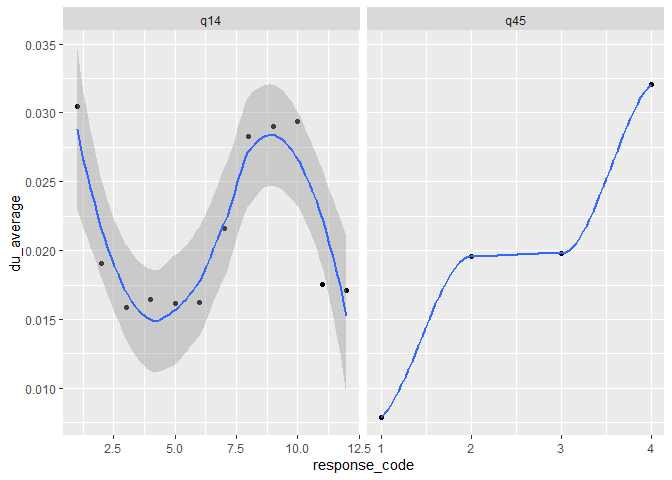

<!-- README.md is generated from README.Rmd. Please edit that file -->

# pvbesscalibrater

<!-- badges: start -->
<!-- badges: end -->

The goal of pvbesscalibrater is to create a set of weights and empirical
partial utilities used by pvbessmicrosimr. This is the micro-calibration
step of the ABM.

Tasks that pvbesscalibrater handles include

- mapping survey adoption likert scores to partial utilities using a
  parameter (epsilon) that describes hypothetical bias
- choice of financial variable(s) in ABM (usually highest bill q14,
  annual bill q_ab or highest and lowest bills q14 and q15)
- finds a set of regularised weights for financial, social and barrier
  terms

## Installation

You can install the development version of pvbesscalibrater like so:

``` r
remotes::install_github(")
```

``` r
library(pvbesscalibrater)
library(tidyverse)
#> ── Attaching core tidyverse packages ──────────────────────── tidyverse 2.0.0 ──
#> ✔ dplyr     1.1.4     ✔ readr     2.1.5
#> ✔ forcats   1.0.0     ✔ stringr   1.5.1
#> ✔ ggplot2   3.5.1     ✔ tibble    3.2.1
#> ✔ lubridate 1.9.3     ✔ tidyr     1.3.1
#> ✔ purrr     1.0.2     
#> ── Conflicts ────────────────────────────────────────── tidyverse_conflicts() ──
#> ✖ dplyr::filter() masks stats::filter()
#> ✖ dplyr::lag()    masks stats::lag()
#> ℹ Use the conflicted package (<http://conflicted.r-lib.org/>) to force all conflicts to become errors
## basic example code
```

## Workflow

\###Preliminary

pvbessmicrosimr has two datasets included: pv_survey and pv_survey_oo
(restricted to owner-occupiers only)

An initial feature selection choosing q14 (highest 2023 bill) as
financial variable

``` r
pv_data <- feature_select(pv_survey_oo,recode_bills=F,drop_lowestbills = T)
```

Transform to adoption utilities (u) instead of LTA likert scores. This
involves choice of a parameter $\epsilon$ that controls the mapping
between stated LTA and utility. $\epsilon=1$ means no hypothetical bias.
$\epsilon=0.7$ is a reasonable choice. An initial feature selection
choosing q14 (highest 2023 bill) as financial variable

``` r
pv_data <- transform_to_utils(pv_data,epsilon=0.7)
```

Create boosted tree object using 5-fold cross validation

``` r
bst <- get_boosted_tree_model(pv_data)
#> Warning in xgb.get.DMatrix(data, label, missing, weight, nthread =
#> merged$nthread): xgboost: label will be ignored.
```

Extract shap scores for individual agents and features from bst

``` r
shap_scores_long <- get_shap_scores(pv_data,bst)
#> Joining with `by = join_by(ID, question_code)`
```

Find the empirical partial utilities for q14 and

You can also embed plots, for example:



In that case, don’t forget to commit and push the resulting figure
files, so they display on GitHub and CRAN.
