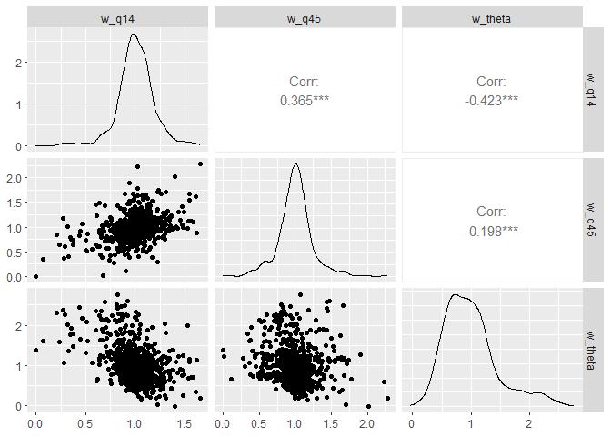

<!-- README.md is generated from README.Rmd. Please edit that file -->

# pvbesscalibrater

<!-- badges: start -->
<!-- badges: end -->

*pvbesscalibrater* creates a micro-calibrated agent-based-model for
household adoption of solar PV and battery energy storage systems
(BESS). The micro-calibrated model consists of a set of empirical
partial utilities and associated weights for each agent. These outputs
are passed to *pvbessmicrosimr* that can run alternative cost and policy
scenarios.

Tasks handled by *pvbesscalibrater* include:

- a mapping stated likelihood-to-adopt (LTA) Likert scores to utilities
- selection of static and dynamic features
- learning of partial utilities and associated weights using gradient
  boosting (*xgboost*)
- derivation of regularised model weights

## Installation

Install the latest development version of *pvbesscalibrater*:

``` r
remotes::install_github("Phalacrocorax-gaimardi/pvbesscalibrater")
#> rlang      (1.1.3  -> 1.1.5 ) [CRAN]
#> glue       (1.7.0  -> 1.8.0 ) [CRAN]
#> cli        (3.6.2  -> 3.6.4 ) [CRAN]
#> colorspace (2.1-0  -> 2.1-1 ) [CRAN]
#> farver     (2.1.1  -> 2.1.2 ) [CRAN]
#> stringi    (1.8.3  -> 1.8.4 ) [CRAN]
#> purrr      (1.0.2  -> 1.0.4 ) [CRAN]
#> jsonlite   (1.8.8  -> 1.9.0 ) [CRAN]
#> data.table (1.15.4 -> 1.16.4) [CRAN]
#> package 'rlang' successfully unpacked and MD5 sums checked
#> package 'glue' successfully unpacked and MD5 sums checked
#> package 'cli' successfully unpacked and MD5 sums checked
#> package 'colorspace' successfully unpacked and MD5 sums checked
#> package 'farver' successfully unpacked and MD5 sums checked
#> package 'stringi' successfully unpacked and MD5 sums checked
#> package 'purrr' successfully unpacked and MD5 sums checked
#> package 'jsonlite' successfully unpacked and MD5 sums checked
#> package 'data.table' successfully unpacked and MD5 sums checked
#> 
#> The downloaded binary packages are in
#>  C:\Users\Joe\AppData\Local\Temp\Rtmp8ElG9M\downloaded_packages
#> ── R CMD build ─────────────────────────────────────────────────────────────────
#>          checking for file 'C:\Users\Joe\AppData\Local\Temp\Rtmp8ElG9M\remotes7c3c63e1742a\Phalacrocorax-gaimardi-pvbesscalibrater-997f3c8/DESCRIPTION' ...  ✔  checking for file 'C:\Users\Joe\AppData\Local\Temp\Rtmp8ElG9M\remotes7c3c63e1742a\Phalacrocorax-gaimardi-pvbesscalibrater-997f3c8/DESCRIPTION'
#>       ─  preparing 'pvbesscalibrater':
#>    checking DESCRIPTION meta-information ...     checking DESCRIPTION meta-information ...   ✔  checking DESCRIPTION meta-information
#>       ─  checking for LF line-endings in source and make files and shell scripts
#>       ─  checking for empty or unneeded directories
#>       ─  building 'pvbesscalibrater_0.0.0.1.tar.gz'
#>      
#> 
```

Load packages

``` r
library(pvbesscalibrater)
library(tidyverse)
```

## Data

*pvbessmicrosimr* includes two survey datasets *pv_survey* and
*pv_survey_oo* where the latter dataset is restricted to owner-occupiers
only.

``` r
dim(pv_survey_oo)
#> [1] 752  43
```

The meaning of the features present in *pv_survey* and *pv_survey_oo*
are described by *pv_questiobs* and *pv_qanda*.

``` r
pv_questions
#> # A tibble: 43 × 2
#>    question_code question                     
#>    <chr>         <chr>                        
#>  1 serial        Serial                       
#>  2 qa            Gender                       
#>  3 qb            Age                          
#>  4 qc2           Region                       
#>  5 qd            Social Grade                 
#>  6 qe            Work status                  
#>  7 qf            Education level              
#>  8 q1            Property type                
#>  9 q2            Stories in building          
#> 10 q3            Number of property's bedrooms
#> # ℹ 33 more rows
```

Some features retained in *pv_survey_oo* are unlikely to be relevant for
model-building. *pvbessmicrosimr* has initial feature selection
built-in. By default, dynamic features are **q14** (highest 2023 bill)
as financial dynamic variable and **q45** as dynamic social influence
variable. All other retained features are treated as static.

``` r
pv_data <- feature_select(pv_survey_oo,recode_bills=F,drop_lowestbills = T)
dim(pv_data)
#> [1] 752  27
```

LTA Likert scores **q46_5** can be replaced by utilities for adoption
(**u**) using simple linear scaling. **u** becomes the dependent
variable in a regression model. *pvbesscalibrater* allows for potential
non-linearity in this mapping via a hypothetical bias parameter
$\epsilon$. $\epsilon=1$ means no hypothetical bias. $\epsilon=0.7$ is a
reasonable initial choice. Macro-calibration using *pvbessmicrosimr*
further corrects for hypothetical bias.

``` r
pv_data <- transform_to_utils(pv_data,epsilon=0.7)
```

### Build

Model-building means regressing the utilities **u** onto the other
features present in *pv_data* using *xgboost*. A boosted tree object
*bst* is obtained using *pvbesscalibrater::get_boosted_tree_model* with
5-fold cross validation to optimise model complexity:

``` r
bst <- get_boosted_tree_model(pv_data)
```

SHAP scores are extracted for each agent and feature from *bst*.

``` r
shap_scores_long <- get_shap_scores(pv_data,bst)
```

For dynamic features, the SHAP scores are interpreted directly as mean
empirical partial utilities for each agent $i$. SHAP scores of static
features are aggregated into a barrier or threshold term $\theta_i$.

The empirical utilities are

``` r
empirical_utils <- get_empirical_partial_utilities(shap_scores_long, regularisation = 1)
```

The model weights are

``` r
regularised_weights <- get_model_weights(shap_scores_long, regularisation = 1)
```

In the above examples, model weights are *regularised* so that weights
for dynamic partial utilities are always positive. The sign of the
barrier weights can have either sign. $regularisation < 1$ can result in
some negative weights. No regularisation ($regularisation = 0$) leads to
a wider spread and 10-15% negative weights which is undesirable.

### Visualisation

Examples of empirical partial utilities for electricity bill category
(**q14**) and number of associates that have installed solar PV
(**q45**).



